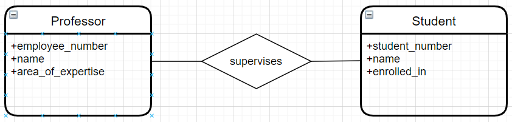

# Part A
## A1
### a)



# Part B
## B1.
### a) 
The `SELECT` command is used to select all the users from the database. 
The `EXTRACT()` function extracts a part from a given date.
The `AS` command is used to rename the column "users.join_date" with the alias "experience".
The `JOIN` command returns rows that have matching values in the tables.
The `WHERE` command specifies the constraint that the software_name must be equal to "MS Word".
The `ORDER BY` command is used to either sort the column in ascending or descending order. By default it is set to ascending order. 
The `COUNT()` function returns the number of rows that matches a specified criterion.

**Input:**
```
SELECT name, EXTRACT(year from age(users.join_date)) AS experience
FROM users
JOIN licenses
ON licenses.user_id = users.id
WHERE licenses.software_name = 'MS Word'
ORDER BY users.name;
```

**Brief description:** Output all the names of users and the number of years which have passed since they joined(aliased as "experience"). The rows in the output table must be sorted in ascending order of name, have the same matching values of `user.id` and `licenses.id` and the license must be for "MS Word" only.

**Output:**
```
  name  | experience
--------+------------
 andrew |          3
 august |          1
 hayden |          2
(3 rows)
```

### b)

**Input:**
```
SELECT name, released_date
FROM softwares
WHERE released_date < '2018-01-01'
ORDER BY released_date ASC;
```

**Brief description:** Output a table with columns `name` and `release_date` based on the `softwares` table. The released_date must be less than 2018-01-01 and must the table must be sorted in ascending order of release_date.

**Output:**
```
  name   | released_date
---------+---------------
 MS Word | 2011-01-20
 Sketch  | 2016-06-15
(2 rows)
```

### c)

**Input:**
```
WITH users_2019 (id, name) AS (SELECT * FROM users WHERE join_date BETWEEN '2019-01-01' AND '2019-12-31')
SELECT id,
name,
count(licenses.access_code) AS num
FROM users_2019
LEFT JOIN licenses ON licenses.user_id = id
GROUP BY name
ORDER BY num DESC;
```


**Output:**
```
Error
```

## B2.
### a)
**Input:**
```
SELECT name
FROM users
WHERE join_date < '2020-01-01';
```
**Output:**
```
  name
--------
 andrew
 hayden
(2 rows)
```

### b)
**Input:**
```
SELECT name, COUNT(software_name) AS licenses_count FROM users
LEFT JOIN licenses ON users.id = licenses.user_id
GROUP BY name
ORDER BY licenses_count DESC, name ASC;
```

**Output:**
```
  name  | licenses_count
--------+----------------
 andrew |              2
 august |              1
 ayana  |              1
 hayden |              1
(4 rows)
```

### c)

**Inserting additional data:**

```
INSERT INTO licenses (user_id, software_name, access_code) VALUES
(50, 'Sketch', 'qwe123'),
(49, 'Obsidian', 'rty456'),
(49, 'SublimeText', 'uio789');
```

**Demo of proper sorting in b):**
```
  name  | licenses_count
--------+----------------
 hayden |              3
 andrew |              2
 august |              2
 ayana  |              1
(4 rows)
```

### d)

**Input:**
```
UPDATE softwares
SET version = '51', released_date = '2020-01-01'
WHERE name = 'Sketch';
```

## B3
### a)

**Adding software_version to licenses table:**
```
BEGIN;
ALTER TABLE licenses
ADD software_version varchar(200);
COMMIT;
```

### b)

**Updating the softwares table to include the name AND version as the primary key**

```
BEGIN;
-- Remove current softwares primary key 
ALTER TABLE softwares
DROP CONSTRAINT softwares_pkey;

-- Set name and software version as primary key
ALTER TABLE softwares
ADD CONSTRAINT softwares_pkey PRIMARY KEY (name, version);
COMMIT;
```

### c)
```
BEGIN;
-- Remove current licenses primary key
DROP CONSTRAINT licenses_pkey;

/*

*/


### d)
